# Arch（完整项目数据流与模块图谱）

## 0. 范围与事实基线

本图谱基于以下代码真实调用链整理：

- 前端入口：`src/main.ts`
- 前端状态与反馈：`src/network-utils.ts`、`src/scan-ui-state.ts`、`src/error-utils.ts`、`src/ui-feedback.ts`
- Tauri 命令入口：`src-tauri/src/lib.rs`
- 后端模块：`src-tauri/src/{core,network,advanced_scan,dns,whois,ssl,process,docker,export,command_exec,app_error}.rs`
- CLI 入口：`src-tauri/src/bin/cli.rs`
- 持久化：`src-tauri/src/export.rs`（`scan_history.json`）

> 结论先行：当前项目没有关系型数据库/嵌入式数据库（如 SQLite）。
> “历史数据存储”是 **本地 JSON 文件持久化**（`scan_history.json`）。

---

## 1. 全局端到端数据流（GUI + CLI）

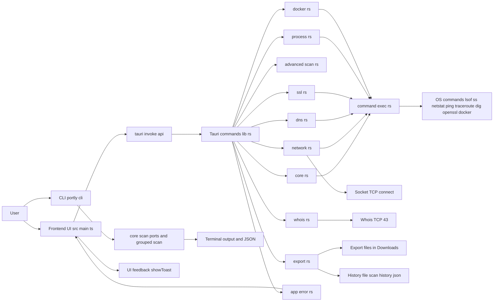

---

## 2. 前端页面级数据流（多视角）

### 2.1 页面与命令路由视角

```mermaid
flowchart TD
    subgraph LocalPage[Local Page]
        L1[scanPorts] --> C1[tauri_scan_ports]
        L1 --> C2[tauri_get_docker_containers]
        L2[scanGrouped] --> C3[tauri_scan_ports_grouped]
        L3[kill process button] --> C4[tauri_kill_process]
        L4[exportData] --> C5[tauri_export_auto]
    end

    subgraph NetworkPage[Network Page]
        N1[loadInterfaces] --> C6[tauri_get_interfaces]
        N1 --> C7[tauri_get_current_subnet]
        N2[discoverDevices] --> C8[tauri_discover_devices]
        N3[scanRemotePorts] --> C9[tauri_quick_scan]
        N3 --> C10[tauri_scan_ports_range]
        N4[manual target resolve] --> C11[tauri_resolve_target]
        N5[single ping] --> C12[tauri_ping_one]
        N6[traceroute] --> C13[tauri_traceroute]
        N7[multi ping] --> C12
    end

    subgraph MonitorPage[Monitor Page]
        M1[startMonitor] --> C8
        M1 --> C12
        M2[render canvas/grid stats] --> UI1[DOM + Canvas]
    end

    subgraph DnsWhoisSsl[DNS / WHOIS / SSL]
        D1[queryDns] --> C14[tauri_dns_query]
        W1[queryWhois] --> C15[tauri_whois_query]
        S1[checkSslCert] --> C16[tauri_check_ssl_cert]
    end

    C1 --> RENDER[Render DOM]
    C2 --> RENDER
    C3 --> RENDER
    C4 --> RENDER
    C5 --> RENDER
    C6 --> RENDER
    C7 --> RENDER
    C8 --> RENDER
    C9 --> RENDER
    C10 --> RENDER
    C11 --> RENDER
    C12 --> RENDER
    C13 --> RENDER
    C14 --> RENDER
    C15 --> RENDER
    C16 --> RENDER
```

### 2.2 前端状态机视角（扫描/监测）

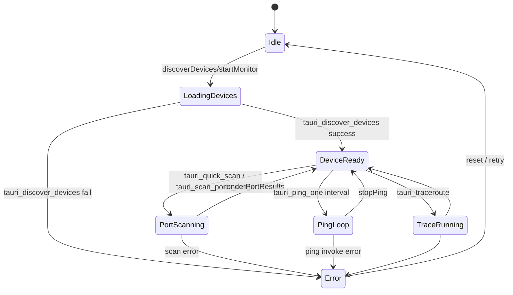

### 2.3 前端错误流视角

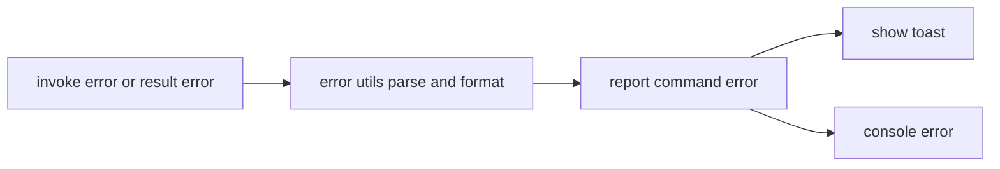

---

## 3. Tauri 命令分发总图（lib.rs）

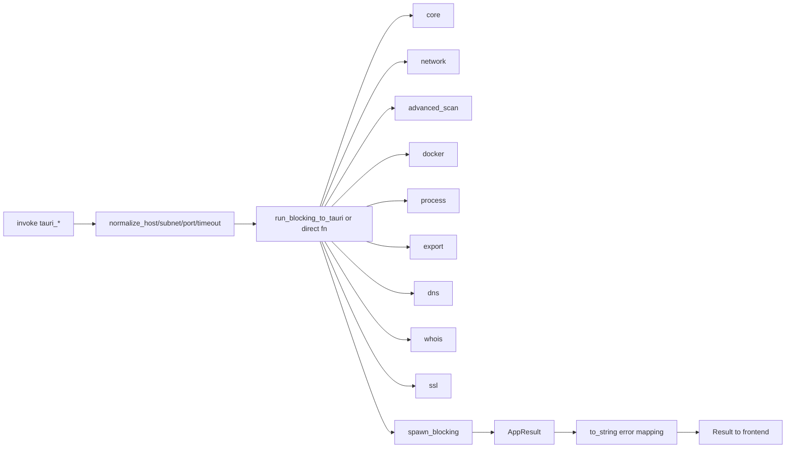

---

## 4. 后端通用执行与错误治理数据流

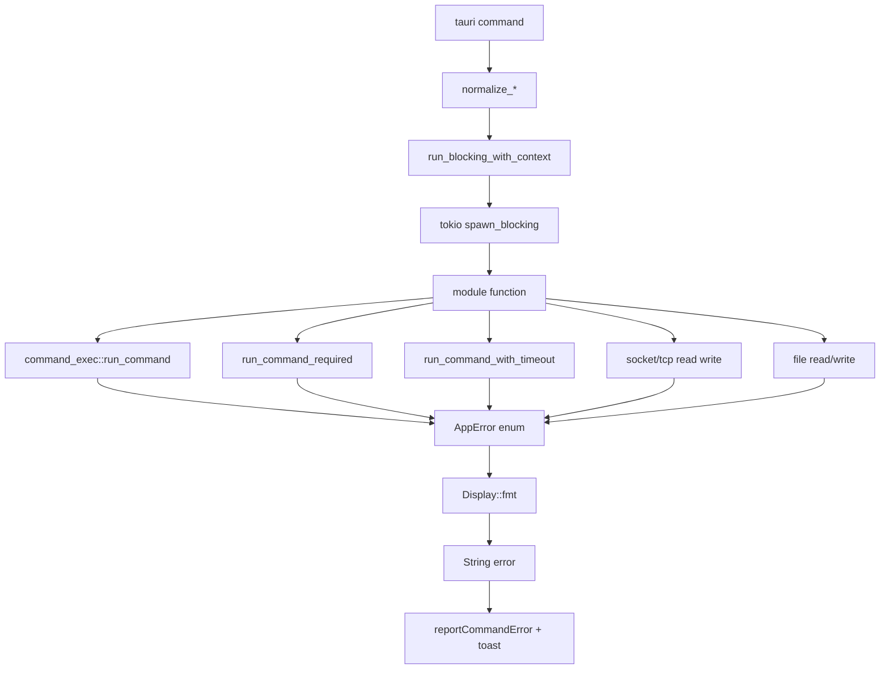

---

## 5. 模块级数据流图（逐模块）

### 5.1 `core.rs`（本机端口扫描）

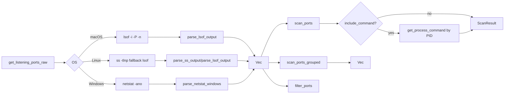

### 5.2 `network.rs`（网段发现 + 远程扫描 + 连通性）

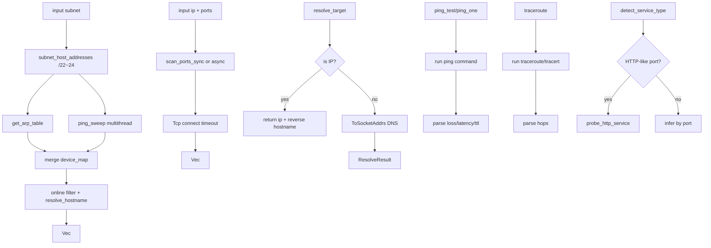

### 5.3 `advanced_scan.rs`（高级扫描策略）

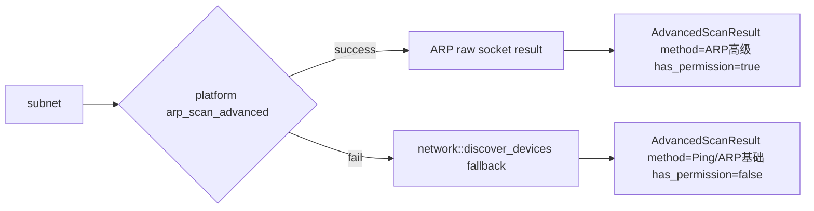

### 5.4 `dns.rs`（多记录 DNS 查询）

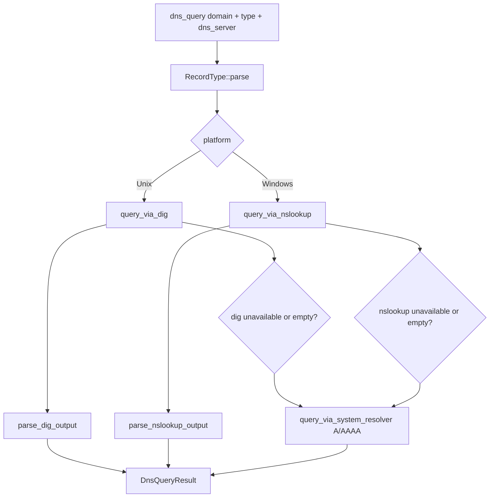

### 5.5 `whois.rs`（Whois 数据流）

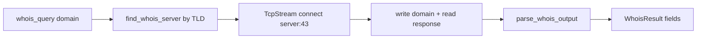

### 5.6 `ssl.rs`（SSL 证书检测）

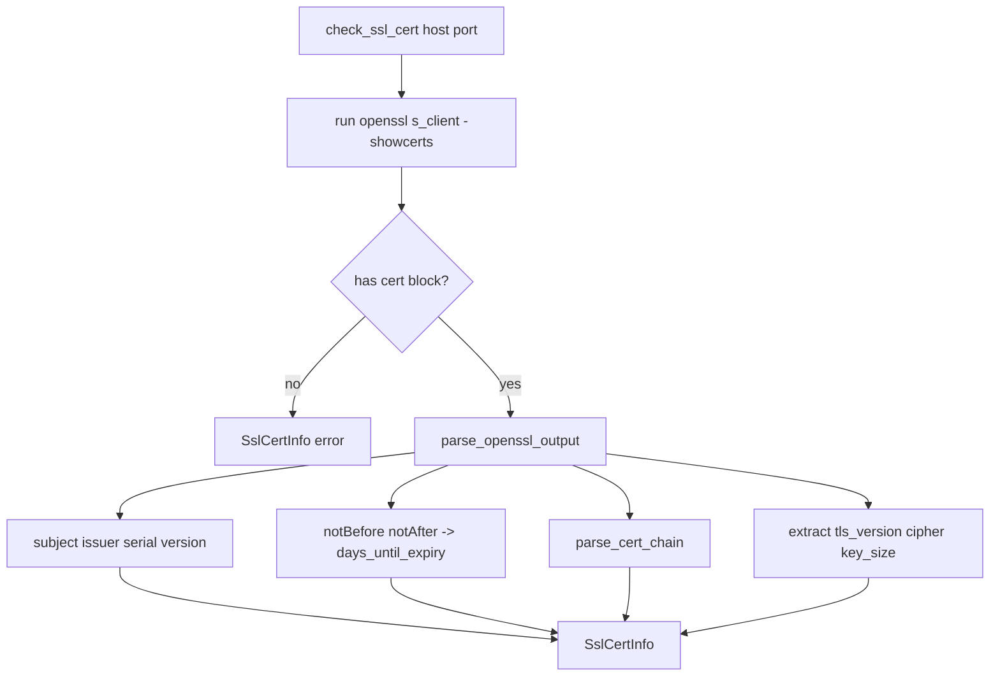

### 5.7 `process.rs`（进程终止）

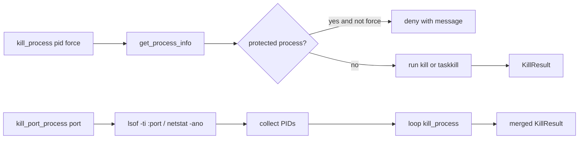

### 5.8 `docker.rs`（容器端口映射）

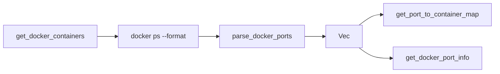

### 5.9 `export.rs`（导出与历史）

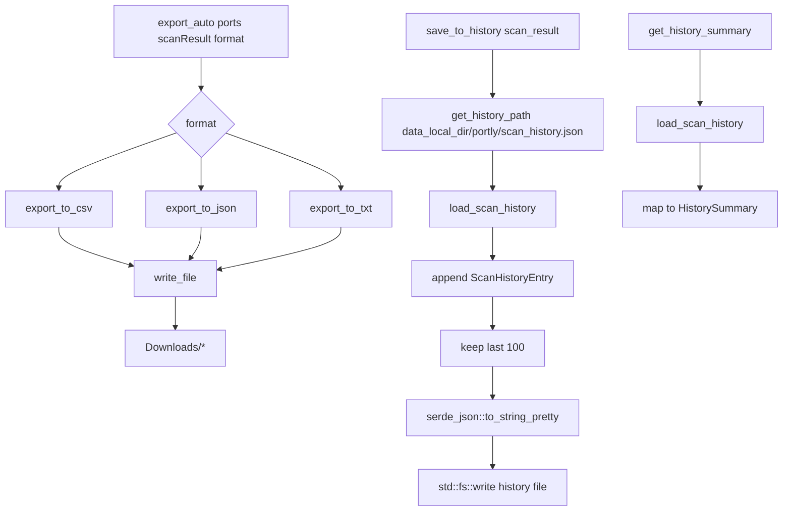

### 5.10 `command_exec.rs` + `app_error.rs`（基础设施）

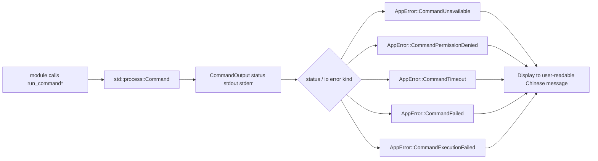

---

## 6. 数据契约结构图（前后端核心对象）

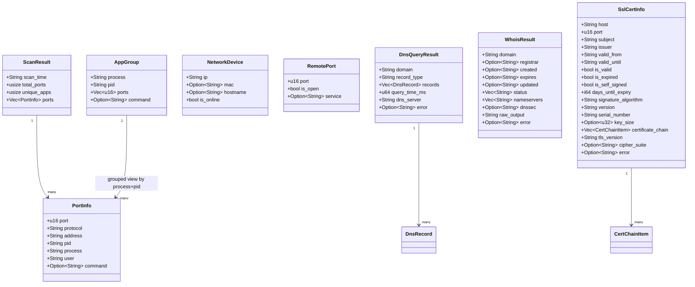

---

## 7. 数据库/持久化结构（文件型“逻辑数据库”）

### 7.1 逻辑 ER 图（`scan_history.json`）

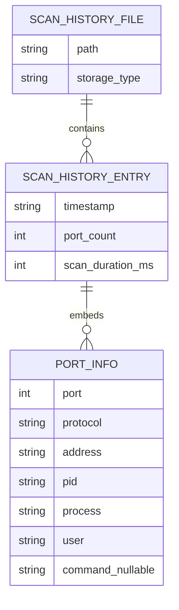

### 7.2 历史读写时序图

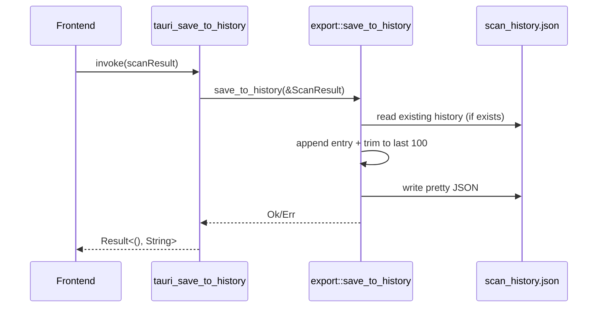

---

## 8. CLI 数据流（独立于 GUI）

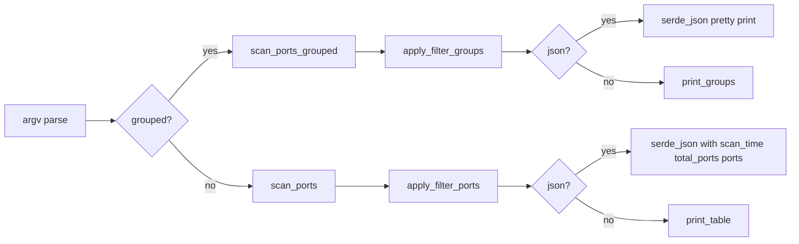

---

## 9. 测试与质量数据流

```mermaid
flowchart TD
    A[vitest test] --> B[src/main.test.ts mock invoke contracts]
    A --> C[src/main.dom.test.ts DOM state transitions]
    A --> D[tests/integration/network-lan.e2e.test.ts]

    E[scripts/network-lan-precheck.mjs] --> D
    E --> F[ENV gate RUN_LAN_E2E + LAN_E2E_SUBNET + LAN_E2E_CONFIRM]

    B --> G[验证前后端命令契约字段]
    C --> H[验证 UI 状态与错误提示流]
    D --> I[验证真实内网执行门禁逻辑]
```

---

## 10. 关键事实总结（用于后续评审）

1. 主数据通路是：`UI 事件 -> invoke -> tauri_* -> 模块函数 -> 系统命令/Socket/File -> 结构化结果 -> DOM/Toast`。
2. 错误通路是：`AppError` 统一分类后文本化，前端统一 `reportCommandError` 与 `showToast` 展示。
3. 网络扫描和监测分为两层：
   - 设备发现层：`discover_devices`（ARP + Ping + 主机名）
   - 连通性/端口层：`scan_ports_range`、`ping_one`、`traceroute`
4. 持久化目前仅有导出文件与扫描历史 JSON 文件，无 SQL/NoSQL 实体库。
5. CLI 与 GUI 共享核心扫描逻辑（`core.rs`），只是入口与展示介质不同。
