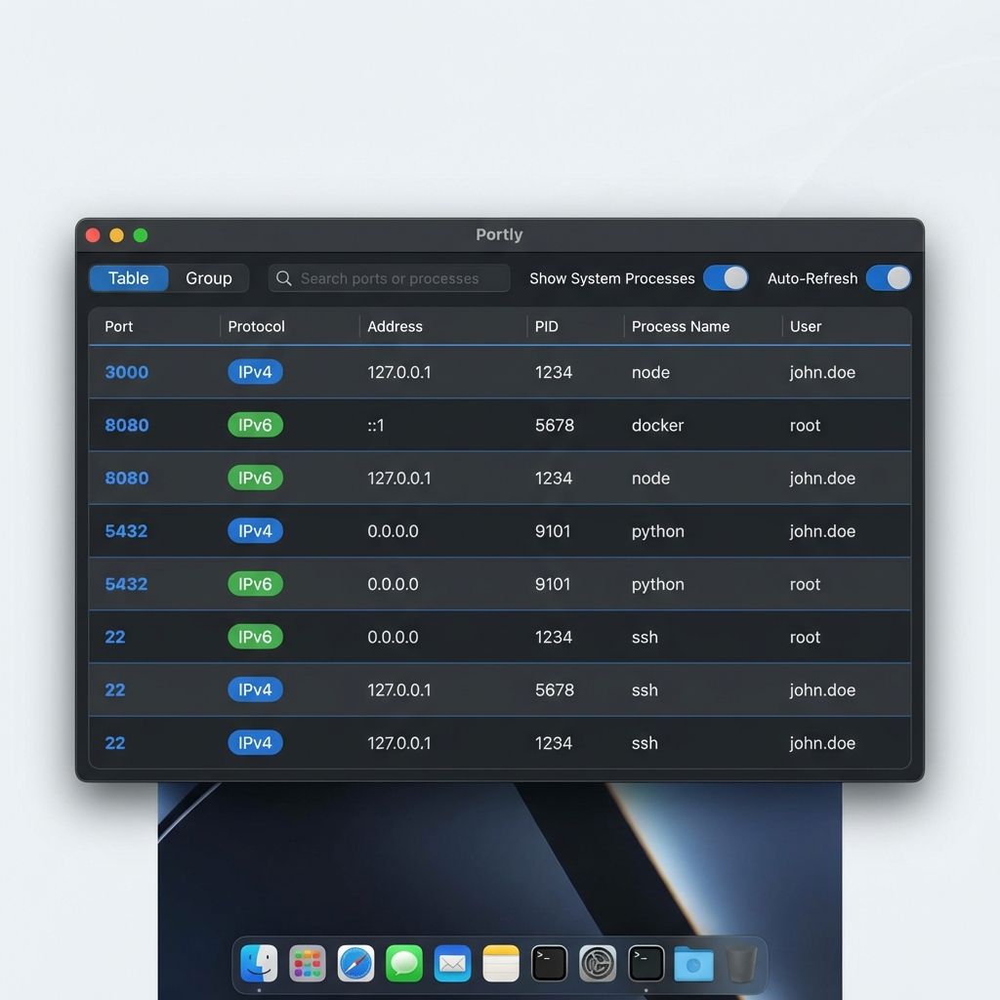

# 🔍 Portly

**跨平台端口扫描器 | Cross-platform Port Scanner**

一个现代化的本地端口扫描工具，支持 GUI 和 CLI 双模式，基于 Tauri + Rust 构建。

A modern local port scanning tool with both GUI and CLI modes, built with Tauri + Rust.


---

<p align="center">
  
</p>

<p align="center">
  
</p>

---

## ✨ Features / 特性

- 🖥️ **Cross-platform / 跨平台** - macOS, Linux, Windows
- 🌓 **Auto Theme / 自动主题** - Follows system dark/light mode / 跟随系统深色/浅色模式
- 📊 **Dual View / 双视图** - Table view & App group view / 表格视图和应用分组视图
- 🔎 **Real-time Filter / 实时过滤** - Filter by app name or port / 按应用名或端口号筛选
- 💻 **GUI + CLI** - Both graphical interface and command line / 图形界面和命令行双模式
- ⚡ **High Performance / 高性能** - Native Rust implementation / Rust 原生实现

---

## 🚀 Installation / 安装

### Download / 下载

Go to [Releases](https://github.com/zots0127/portly/releases) to download for your platform.

前往 [Releases](https://github.com/zots0127/portly/releases) 下载对应平台的安装包。

### Build from Source / 从源码构建

```bash
git clone https://github.com/zots0127/portly.git
cd portly
npm install
npm run tauri build
```

---

## 📖 Usage / 使用方法

### GUI

| Feature | Description |
|---------|-------------|
| Table / Group | Switch between list and grouped view |
| Filter | Filter by app name or port number |
| Command | Show full process command line |
| Hide System | Exclude system processes |

### CLI

```bash
portly-cli                    # List all ports / 列出所有端口
portly-cli -g                 # Group by app / 按应用分组
portly-cli -j                 # JSON output / JSON 输出
portly-cli -c                 # Show command / 显示命令行
portly-cli -f docker          # Filter app / 过滤应用
portly-cli -p 8080            # Filter port / 过滤端口
portly-cli -x                 # Exclude system / 排除系统进程
portly-cli -h                 # Help / 帮助
```

---

## 🛠️ Tech Stack / 技术栈

- **Frontend**: TypeScript + Vite
- **Backend**: Rust + Tauri 2.0
- **Styling**: Native CSS with `prefers-color-scheme`

---

## 🗺️ Roadmap

- [x] Cross-platform port scanning / 跨平台端口扫描
- [x] GUI + CLI dual mode / GUI + CLI 双模式
- [x] Auto dark/light theme / 自动深色/浅色主题
- [ ] **Port tunneling to public URL / 本地端口发布到公网地址** 🚀
- [ ] Process kill feature / 进程终止功能
- [ ] Port usage history / 端口使用历史记录

---

## 📄 License

[MIT License](LICENSE) - Copyright (c) 2026 Wang Bojun

---

## 🤝 Contributing / 贡献

Issues and Pull Requests are welcome!

欢迎提交 Issue 和 Pull Request！

---

Made with ❤️ using Tauri + Rust 🦀
